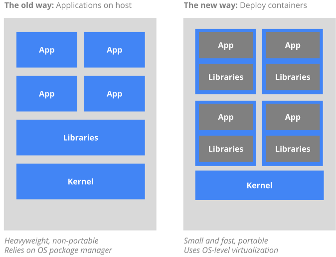

+++
menutitle = "Kubernetes"
date = 2018-12-29T17:15:52Z
weight = 9
chapter = false
pre = "<b>- </b>"
+++

# Kubernetes

Kubernetes is a portable, extensible open-source platform for managing containerized workloads and services, that facilitates both declarative configuration and automation. It has a large, rapidly growing ecosystem. Kubernetes services, support, and tools are widely available.

Google open-sourced the Kubernetes project in 2014. Kubernetes builds upon a decade and a half of experience that Google has with running production workloads at scale, combined with best-of-breed ideas and practices from the community

[Read More here](https://kubernetes.io/docs/concepts/overview/what-is-kubernetes/)

### Kubernetes Architecture

#### Container runtime

Docker , rkt , containerd or any OCI compliant runtime which will download image , configures network , mount volumes and assist container life cycle management.

#### kubelet

Responsible for instructing container runtime to start , stop or modify a container

#### kube-proxy

Manage service IPs and iptables rules

#### kube-apiserver

API server interacts with all other components in cluster
All client interactions will happen via API server

#### kube-scheduler

Responsible for scheduling workload on minions or worker nodes based on resource constraints

#### kube-controller-manager

Responsible for monitoring different containers in reconciliation loop
Will discuss more about different controllers later in this course

#### etcd

Persistent store where we store all configurations and cluster state

#### cloud-controller-manager

Cloud vendor specific controller and cloud vendor is Responsible to develop this program
