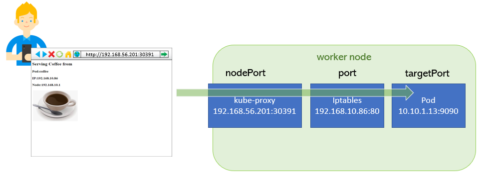

+++
menutitle = "NodePort"
date = 2018-12-29T17:15:52Z
weight = 2
chapter = false
pre = "<b>- </b>"
+++

# How `Service` object with type `nodePort` works ?

kube-proxy watches the Kubernetes master for the addition and removal of Service and Endpoints objects.

(We will discuss about `Endpoints` later in this session.)

For each `Service`,  it opens a port (randomly chosen) on the local node. Any connections to this “proxy port” will be proxied to one of the Service’s backend Pods (as reported in Endpoints). Lastly, it installs iptables rules which capture traffic to the Service’s `clusterIP` (which is virtual) and Port and redirects that traffic to the proxy port which proxies the backend Pod.

#### `nodePort` workflow.

`nodePort` -> `30391`

`port` -> `80`

`targetPort` -> `9090`

